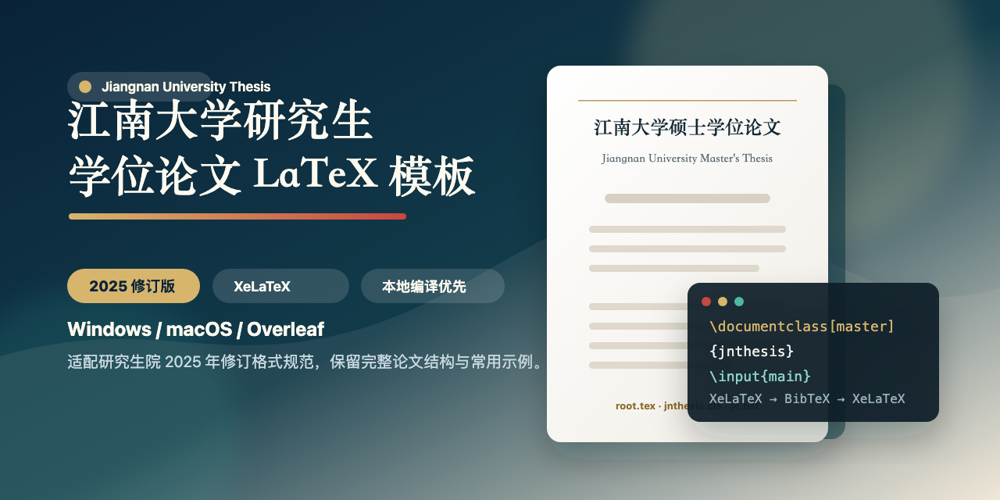

# 江南大学研究生学位论文 LaTeX 模板（2025 修订版）

<p align="center">
  
</p>

本仓库是适配《江南大学研究生学位论文要求及格式规范（2025年修订）》的江南大学研究生学位论文 LaTeX 模板，支持 Windows、macOS 本地编译，也可导入 Overleaf 使用。模板基于 Bo Zhuang 的原版 `jnthesis` 修改，面向硕士学位论文、博士学位论文和毕业论文写作。

关键词：江南大学论文模板、江南大学研究生学位论文模板、江南大学硕士论文模板、江南大学博士论文模板、江南大学 LaTeX 模板、江南大学 Overleaf 模板、江南大学 2025 论文格式、江南大学本地 LaTeX 编译、Jiangnan University thesis template、jnthesis。

> 原版项目：<https://gitee.com/zhuangbo/jnthesis>
>
> 江南大学研究生院官方说明：<https://gs.jiangnan.edu.cn/info/1057/2812.htm>
>
> 项目主页：<https://lou-kaiqiang.github.io/jnuthesis-2025-latex-template/>

## 快速开始（推荐本地编译）

论文项目包含图片、PDF 封面和参考文献后可能超过 Overleaf 免费版项目大小限制，因此更推荐在本地安装 TeX 发行版后编译。

通用命令行编译方式：

```bash
xelatex root.tex
bibtex root
xelatex root.tex
xelatex root.tex
```

只改正文且没有新增参考文献时，通常执行一次即可：

```bash
xelatex root.tex
```

## Windows 本地方案

推荐组合：

- TeX 发行版：TeX Live 或 MiKTeX
- 编辑器：TeXstudio，或 VS Code + LaTeX Workshop
- 编译器：XeLaTeX
- 主文件：`root.tex`

TeXstudio 设置：

1. 安装 TeX Live 或 MiKTeX。
2. 安装 TeXstudio。
3. 用 TeXstudio 打开 `root.tex`。
4. 在 `Options -> Configure TeXstudio -> Build` 中，将默认编译器设置为 `XeLaTeX`。
5. 点击编译按钮；若参考文献未生成，依次执行 XeLaTeX、BibTeX、XeLaTeX、XeLaTeX。

VS Code 设置：

1. 安装 TeX Live 或 MiKTeX。
2. 安装 VS Code 扩展 `LaTeX Workshop`。
3. 打开本仓库文件夹。
4. 打开 `root.tex`，选择 XeLaTeX recipe 编译。

## macOS 本地方案

推荐组合：

- TeX 发行版：MacTeX
- 编辑器：TeXShop，TeXstudio，或 VS Code + LaTeX Workshop
- 编译器：XeLaTeX
- 主文件：`root.tex`

TeXShop 设置：

1. 安装 MacTeX。
2. 用 TeXShop 打开 `root.tex`。
3. 左上角编译方式选择 `XeLaTeX`。
4. 点击 Typeset 编译；若参考文献未生成，按 XeLaTeX、BibTeX、XeLaTeX、XeLaTeX 的顺序编译。

命令行编译：

```bash
cd path/to/jnthesis
xelatex root.tex
bibtex root
xelatex root.tex
xelatex root.tex
```

## Overleaf 方案（可选）

1. 将本仓库下载为 ZIP，或 fork 后导入 Overleaf。
2. 在 Overleaf 左上角打开 `Menu`。
3. `Compiler` 选择 `XeLaTeX`。
4. `Main document` 选择 `root.tex`。
5. 如遇中文拼写检查提示，可将 `Spell check` 关闭。
6. 编译 `root.tex`。

如果参考文献没有正确生成，请按以下顺序完整编译：

```text
XeLaTeX -> BibTeX -> XeLaTeX -> XeLaTeX
```

## 文件结构

| 文件/目录 | 说明 |
| --- | --- |
| `root.tex` | 主入口文件，设置论文类型并组织全文结构 |
| `main.tex` | 正文章节入口，可增删 `body/*.tex` |
| `jnthesis.cls` | 江南大学论文格式文档类 |
| `jn.bst` | BibTeX 参考文献样式 |
| `setup/settings.tex` | 标题、作者、字体、宏包等用户设置 |
| `setup/userdefs.tex` | 用户自定义命令 |
| `preface/c_abstract.tex` | 中文摘要与关键词 |
| `preface/e_abstract.tex` | 英文摘要与关键词 |
| `body/ch01.tex` - `body/ch05.tex` | 示例正文章节 |
| `appendix/acknowledgements.tex` | 致谢 |
| `appendix/publications.tex` | 攻读学位期间取得的学术成果清单 |
| `references.bib` | 参考文献数据库 |
| `figures/` | 图片目录，用户可自行创建和放置图片 |

## 常用修改

在 `root.tex` 中选择论文类型：

```tex
\documentclass[master]{jnthesis} % 硕士学位论文
% \documentclass[doctor]{jnthesis} % 博士学位论文
% \documentclass[nodegree]{jnthesis} % 毕业论文
```

在 `setup/settings.tex` 中修改题目、作者和必要宏包：

```tex
\title{江南大学硕士学位论文题目}
\author{作者姓名}
```

在 `main.tex` 中管理正文章节：

```tex
\include{body/ch01}
\include{body/ch02}
```

正式提交时，封面、原创性声明、版权使用授权书、答辩委员会名单等页面通常需要按学校或学院要求生成 PDF 后插入。`root.tex` 中保留了对应示例注释：

```tex
% \includepdf{cover.pdf}
% \cleardoublepage
% \includepdf{statement.pdf}
```

## 说明

- 本模板以公开发布和本地/Overleaf 编译使用为目标，仓库内只保留占位示例内容，不包含个人论文正文、实验数据或个人成果。
- 学校格式规范可能继续更新，提交前请以[江南大学研究生院官方说明](https://gs.jiangnan.edu.cn/info/1057/2812.htm)、学院通知或导师要求为准。
- 如发现格式问题，欢迎提交 issue 或 pull request。

## 致谢

感谢 Bo Zhuang 提供原版江南大学学位论文 LaTeX 模板。本仓库在原版基础上修复部分 Overleaf 编译问题，并结合 2025 年修订格式要求做了适配。

## License

MIT License. See `LICENSE.txt`.
